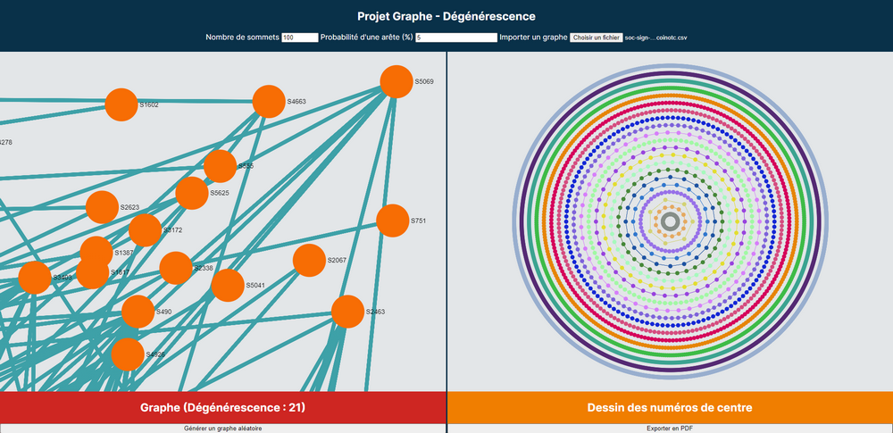

<div id="top"></div>

<!-- PROJECT LOGO -->
<br />
<div align="center">
  <h3 align="center">Graph Degeneracy</h3>
  <p align="center">
    <a href="https://akwd22.github.io/graph-degeneracy/">View Website</a> ·
    <a href="https://youtu.be/mjWiRz99-f8">View Demo</a>
  </p>
</div>

<!-- TABLE OF CONTENTS -->
<details>
  <summary>Table of Contents</summary>
  <ol>
    <li><a href="#about-the-project">About The Project</a></li>
    <li><a href="#context">Context</a></li>
    <li><a href="#built-with">Built With</a></li>
    <li><a href="#documentation">Documentation</a></li>
    <li><a href="#getting-started">Getting Started</a></li>
    <li><a href="#usage">Usage</a></li>
    <li><a href="#contributors">Contributors</a></li>
    <li><a href="#acknowledgments">Acknowledgments</a></li>
  </ol>
</details>

<!-- ABOUT THE PROJECT -->
## About The Project

<div align="center">
  <a href="https://akwd22.github.io/graph-degeneracy/"></a>
</div>
<br />

This project is a small application to **compute** and **visually represent** the **degeneracy** of large graphs.

### Features

- [x] Randomly generate graphs of varying order and size.
- [x] [Import graphs](#usage).
- [x] Calculation of the degeneracy.
- [x] Visual and interactive representation of graphs.
- [x] Visual representation of k-cores.
- [x] Export to PDF the graph visualization.

<p align="right">(<a href="#top">back to top</a>)</p>

<!-- CONTEXT -->
## Context

This project is an academic project made during the **third year** of a **Bachelor of Computer Science**.  
The development was done by 2 people.

<p align="right">(<a href="#top">back to top</a>)</p>

<!-- BUILT WITH -->
## Built With

JavaScript libraries:
- [Sigma.js](https://www.sigmajs.org/) to represent graphs visually.
- [jsPDF](https://parall.ax/products/jspdf) for PDF export.

<p align="right">(<a href="#top">back to top</a>)</p>

<!-- DOCUMENTATION -->
## Documentation

You can find documentation files such as technical details in the folder `docs/`.

### Import File Format

The file is a text file containing for each line, a pair of node numbers, the first node is the start of an edge and the second node is the destination of an edge.
- If the file is a `.txt`, then the nodes are separated by a space or a tab.
- If the file is a `.csv`, then the nodes are separated by a comma.

<details>
  <summary>Show an example of a text file</summary>
  <p>
  
  ```
  # A tree, depth 2.
  1 2
  1 3
  2 1
  2 4
  2 5
  3 1
  3 6
  4 2
  5 2
  6 3
  ```
  
  </p>
</details>

<details>
  <summary>Show an example of a CSV file</summary>
  <p>
  
  ```
  # 3-vertex clique.
  1,2
  2,1
  2,3
  3,1
  3,2
  ```
  
  </p>
</details>

<p align="right">(<a href="#top">back to top</a>)</p>

<!-- GETTING STARTED -->
## Getting Started

To get a local copy up and running, just open `src/index.html` in your favorite browser.

<p align="right">(<a href="#top">back to top</a>)</p>

<!-- USAGE -->
## Usage

You can find some graph samples to import in the folder `samples/`, otherwise, you can download more on [SNAP](http://snap.stanford.edu/data/index.html) for example.

<p align="right">(<a href="#top">back to top</a>)</p>

<!-- Contributors -->
## Contributors

This project was made by:
- [Eddy D.](https://github.com/Akwd22)
- [Clément G.](https://github.com/Zoreph22)

<p align="right">(<a href="#top">back to top</a>)</p>

<!-- ACKNOWLEDGMENTS -->
## Acknowledgments

* [Stanford Network Analysis Project](http://snap.stanford.edu/) for graph samples.

<p align="right">(<a href="#top">back to top</a>)</p>
